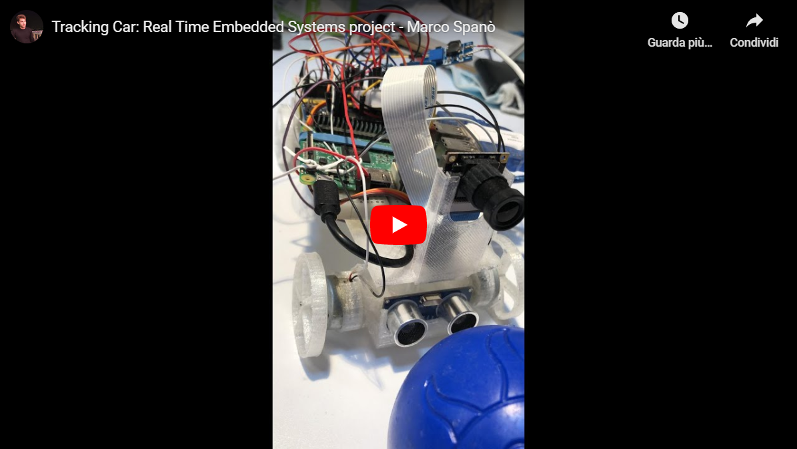

# RTES-trackingCar

## Introduction

Tracking Car: A Real-Time application drives the car to chase a blue ball till the ball is not reached or lost from the camera view. Using an ultrasonic sensor on the front, the car is also able to cut off the engine when the object is close to the vehicle or an obstacle is found. Two videos are recorded from the camera during the whole run, one directly from the camera and one after the detection process (showing in white what it has detected).

The car is completely assembled from scratch. It is composed by:
- 3D printed chassis, steering block and wheels
- Raspberry Pi 3 model B
- MicroSD 8 GB
- USB key 128GB
- Arduino UNO
- Camera module for Raspberry
- 4x PS3 DualShock Controller Vibration Motors
- Step up boost converter
- Micro Servo MG90S
- Ultrasonic Sensor HC-SR04
- Relay module
- Capacitor
- Transistor
- Diode
- Resistor
- Breadboard
- Wirings

## Instructions

### Arduino

For Arduino you just need to download the Arduino IDE and that's it.
In order to use the ultrasonic sensor, we need to download the NewPing library from [here](https://playground.arduino.cc/Code/NewPing/) and add it in the */libraries/* folder of Arduino.

### External dependecies

**Pre-install**

>sudo apt-get update && sudo apt-get upgrade -y\
sudo apt-get update && sudo apt-get dist-upgrade\
sudo apt-get install git\
sudo apt-get install build-essential (already present in raspbian)\
sudo apt-get install cmake\
sudo apt-get install libsdl2-dev\
sudo apt-get install libgtkmm-3.0-dev\
sudo apt-get install liballegro4.2-dev

**Enable the camera**
>sudo raspi-config

**WiringPi:**

>sudo apt-get install wiringpi

*(I had to use a USB key for that)*

>sudo mount /dev/sda1 /mnt\
cd /mnt

**Opencv:**

>git clone https://github.com/opencv/opencv.git \
git clone https://github.com/opencv/opencv_contrib.git \
cd opencv \
mkdir build \
cd build \
cmake -DOPENCV_EXTRA_MODULES_PATH=../../opencv_contrib/modules ..\
make -j4 (Raspberry has a quad-core processor)\
make install

**Ptask:**

 >git clone https://github.com/glipari/ptask.git \
 mkdir build\
 cd build\
 cmake ..\
 make\
 make install

### Build & Run

 >mkdir build\
 cd build\
 sudo cmake ..\
 sudo make\
 sudo ./application
